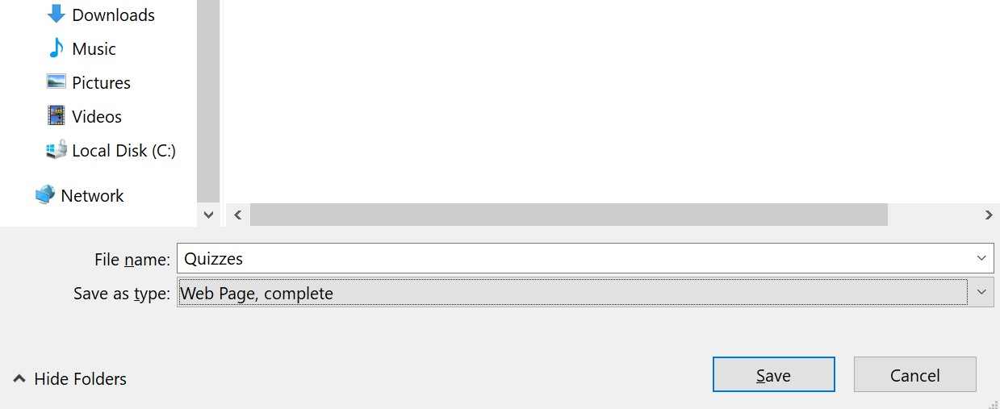
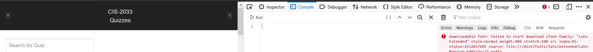
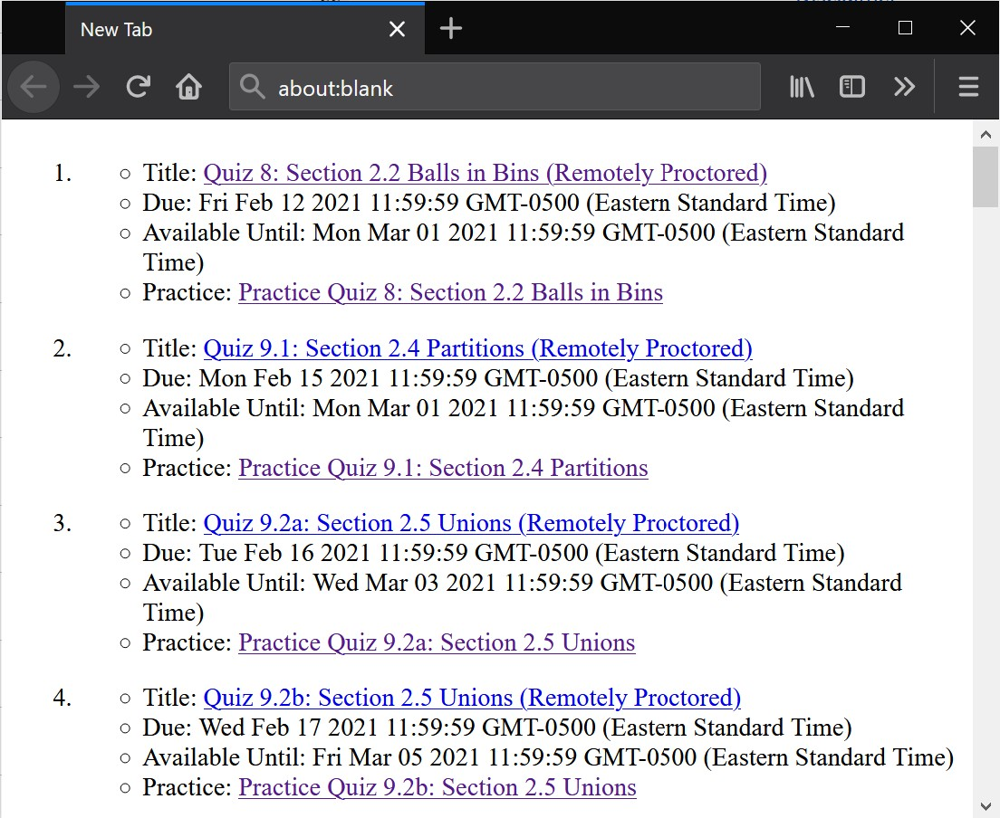

# Canvas Assignment Parser

- [How To](#how-to-use)
- [How it works](#how-it-works)
- [Why did you do this?](#why)

## How to Use

`quizzes-parse.js`
1. [Archive](#archiving) the "Quizzes" page as an html file.
2. Open the archived html file, and bring up the [web console](#using-the-web-console) in your browser.
3. Copy the code into the console in multi-line editor mode.
4. Run the code.

## Archiving

Download the "Quizzes" page. `Ctrl+S` brings up the save file dialog if you use Firefox.

I archive the page as a complete webpage.

## Using the Web Console

Open the archived page in your web browser and bring up the web console. `Ctrl+Shift+K` brings up the web console in Firefox.

Switch to the multi-line editor. It should look something like this:

Copy and paste the contents of quizzes-parse.js into the editor, and hit run.

This will open up a new tab, so if your browser blocks the pop-up be sure to allow the page to display pop-ups.

The resultant tab should have the following contents:

You can archive this page to quickly see the quizzes that need to be completed without having to log in to canvas all the time.

## How it works

The code is written in javascript. It looks for specific html elements with `.querySelectorAll('.quiz')`, those html elements map to quiz items (Practice quizzes and Remotely proctored quizzes). The code adds them to a dictionary along with some properties relating to that quiz.

Displaying the quizzes into a new tab is straightforward. The code iterates through the dictionary and filters for quizzes that have an "Available Until" date. The filtering step effectively grabs only the proctored quizzes, and since the proctored quizzes have almost the same title as their respective practice quiz, it is trivial to do a dictionary lookup for the practice quiz in the same iteration.

## Why

Good question... I don't really have an answer. All I can say is that it allows me to get a good overview on what needs to be done. 

